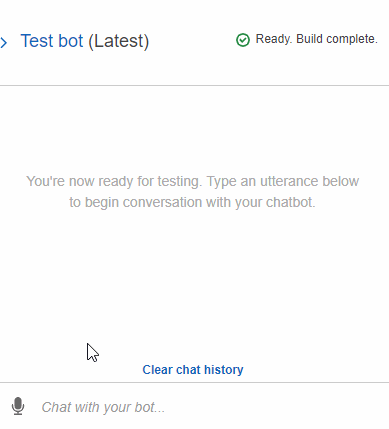
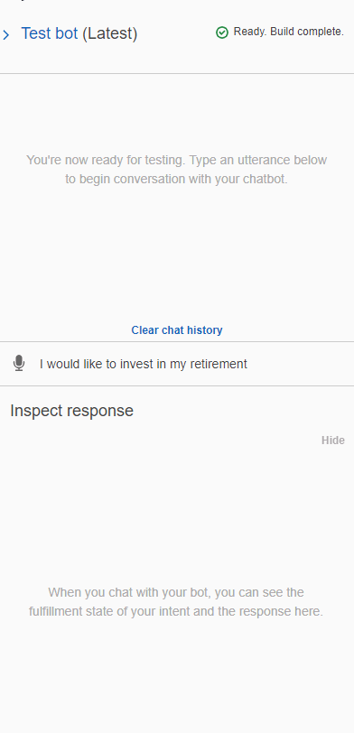

# Challenge_15: RoboAdvisors
UNCC Online FinTech Bootcamp Module 15 Challenge due by 11:59pm 3/20/2022


image from [courses.bootcampspot.com](https://courses.bootcampspot.com/courses/980/assignments/20388?module_item_id=377902)

---

## Background

We’ve been hired as a digital transformation consultant by one of the most prominent retirement plan providers in the country. They want to increase their client portfolio—especially by engaging young people. Because machine learning and NLP are disrupting finance to improve the customer experience, we decide to create a robo advisor. Both existing and potentially new customers will be able to use this robo advisor to get investment portfolio recommendations for retirement.

---

## What is Being Created

We’ll combine our new AWS skills with our existing Python superpowers to create a bot that will recommend an investment portfolio for a retirement plan.

We’ll be asked to accomplish the following main tasks:

  1. Configure the initial robo advisor: Define an Amazon Lex bot with a single intent that establishes a conversation about requirements to suggest an investment portfolio for retirement.

  2. Build and test the robo advisor: Make sure that our bot works and accurately responds during the conversation with the user.

  3. Enhance the robo advisor with an Amazon Lambda function: Create an Amazon Lambda function that validates the user's input and returns the investment portfolio recommendation. This includes testing the Amazon Lambda function and integrating it with the bot.

---

## Technologies

This application is written in Python 3.7 using Amazon Web Services (AWS).

[Amazon Lex](https://aws.amazon.com/lex/) - *a fully managed artificial intelligence (AI) service with advanced natural language models to design, build, test, and deploy conversational interfaces in applications.*

[Amazon Lambda](https://aws.amazon.com/lambda/) - *a serverless, event-driven compute service that lets you run code for virtually any type of application or backend service without provisioning or managing servers.*

---

## Usage

### 1. Pre-Lambda robo advisor:



### 2. Post-Lambda robo advisor:



#### Sample of code from final [lambda_function.py](lambda_function.py):
```python
    #Determine the appropriate recommendation based on the user's stated risk level.
    risk_level = risk_level.lower()
    if risk_level == "none":
        recommendation = "100% bonds (AGG), 0% equities (SPY)"
    elif risk_level == "low":
        recommendation = "60% bonds (AGG), 40% equities (SPY)"
    elif risk_level == "medium":
        recommendation = "40% bonds (AGG), 60% equities (SPY)"
    else:
        recommendation = "20% bonds (AGG), 80% equities (SPY)"
```

---

## Contributors
Geoff Tarleton - jobeycat@protonmail.com

adapted from Starter Code supplied by UNCC FinTech Online Bootcamp by Trilogy Educational Services, a 2U, Inc. brand.

---

## License

[MIT](LICENSE)